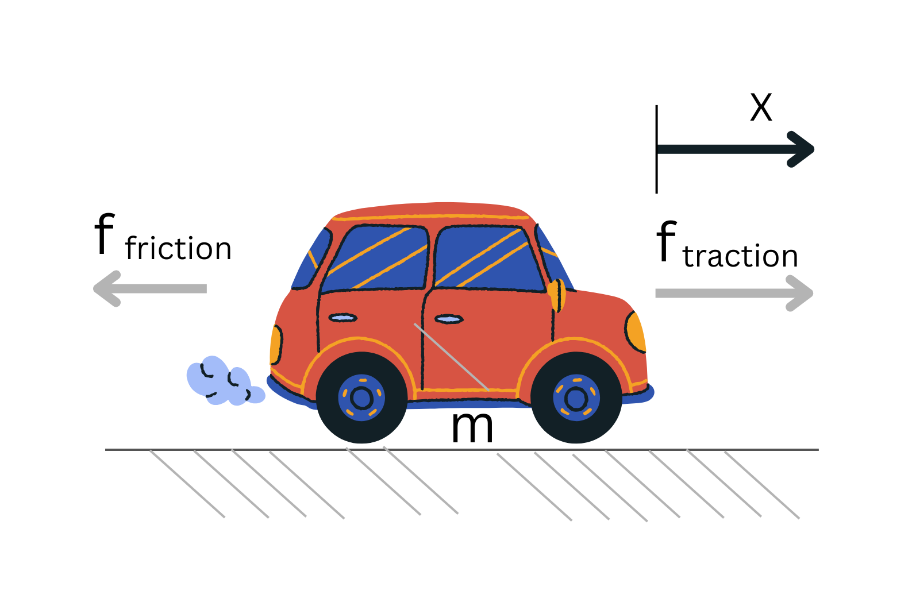

## Mathematical Modelling: Linear Time-Invariant (LTI) Models

### First Principles Modelling

In electrical engineering, mathematical modelling uses mathematical language and symbols to describe the behaviour and characteristics of electrical systems, components, and signals.

In control engineering, the first step toward designing a controller is building an accurate mathematical model of the system. This process often begins with **first principles modelling**, where we apply fundamental physical laws such as:

- Newton’s Laws (mechanical systems)
- Kirchhoff’s Laws (electrical circuits)
- Conservation laws (energy, mass, charge)

By translating real-world system behaviour into mathematical equations, we obtain a model that describes how inputs affect outputs.

This modelling process provides:

- Deeper understanding of system behaviour
- Predictive capability under different conditions
- A foundation for controller design

---

### What are Linear Time-Invariant (LTI) Models?

Many practical engineering systems can be represented — or approximated — as **Linear Time-Invariant (LTI)** systems.

An LTI system has two key properties:

- **Linearity**  
  The output is proportional to the input, and the principle of superposition applies.

- **Time invariance**  
  The system’s characteristics do not change over time.

Because of these properties, LTI systems are mathematically convenient and highly powerful.

They can be described using:

- Differential equations
- Transfer functions
- State-space representations

---

## Mathematical Model of a Vehicle (Semi-Truck Example)

To make the modelling process concrete, consider the longitudinal motion of a vehicle.

In control system terminology, the system being controlled is called the **plant**.  
Here, the vehicle is the plant.

---

### Physical Interpretation

The vehicle can be modelled as a lumped mass \( m \) with two forces acting along the direction of motion:

- f_traction: traction force generated by the engine and drivetrain (forward direction)
- f_friction: resistive force opposing motion (rolling resistance + aerodynamic drag)

---

### Dynamic Variables

State variables:

- \( x \): position  
- \( ẋ \): velocity  
- \( ẍ \): acceleration  

Parameters:

- \( m \): total mass of the vehicle  
- \( b \): equivalent damping/friction coefficient  

---

## LTI Differential Equation Model

Applying Newton's Second Law, the *equation of motion* (or governing equation) for this system is:
∑F = mẍ = f_traction + f_friction = u-bẋ

Rewriting the equation gives the following **linear, time-invariant differential equation** that relates the vehicle’s travel distance \( x \) (the plant’s *output*) to the traction force \( u \) (the plant’s *input*) by way of the system parameters \( m \) and \( b \):
ẍ = 1/m(u-bẋ)

By integrating the vehicle’s acceleration twice and with knowledge of its initial position and speed, this equation tells you where the vehicle will be at any instant in time.

The future behaviour of a system modelled from first principles is dictated by its governing equation and initial conditions.

---

## Transfer Function Model

Transfer functions are an alternative way of mathematically modelling a dynamic system.

A transfer function gives a mathematical description of a physical system using a ratio of two polynomials in the Laplace variable \( s \).  
The numerator polynomial represents the system’s output and the denominator polynomial represents its input.

This training course will skip the derivation of the transfer function. The transfer function of the vehicle is:

\[
G(s) = X(s)/U(s) = \frac{1}{ms^2 + bs}
\]

## Flow of the Session

1. Setup verification
2. Control systems model
3. Circuit simulation
4. Power systems modelling
5. Wrap-up

👉 Start here: [Setup](setup.qmd)

